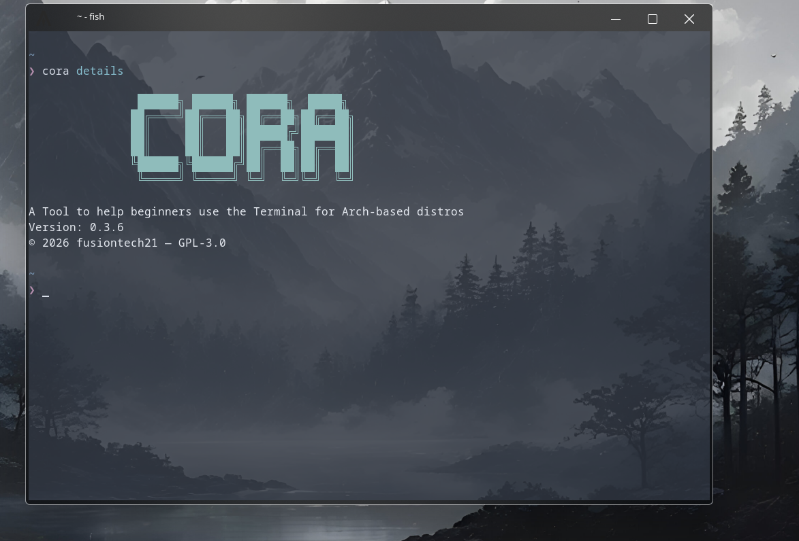
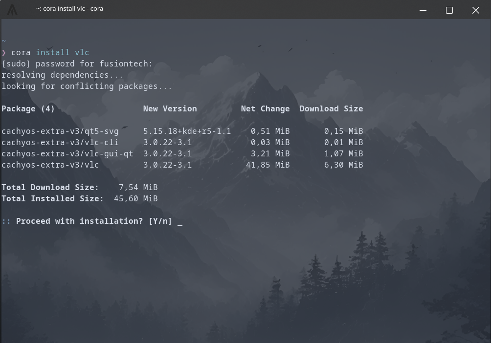

# Fusi 🦀

[](https://www.gnu.org/licenses/agpl-3.0.html)
[](https://rust-lang.org)
[](https://archlinux.org)

Fusi is a terminal tool for Arch-based distros that replaces complex pacman commands with simple human-readable ones. Instead of `sudo pacman -S pkg` you just type `fusi install pkg`. Includes package management, mirror updates, system maintenance and more — built to make the terminal accessible for Linux beginners.

---

## Installation

### IF YOU DONT HAVE GIT MAKE SURE TO INSTALL IT HERES THE COMMAND
```bash
sudo pacman -S git
sudo pacman -Syu
```

### One line install
```bash
curl -s https://raw.githubusercontent.com/fusiontech21/Fusi/main/setup/install.sh | bash
```

### Manual install
```bash
git clone https://github.com/fusiontech21/Fusi
cd Fusi
cargo build --release
sudo cp target/release/fusi /usr/local/bin/
```

### Requirements
- Rust + Cargo
- An Arch-based distro (Arch, CachyOS, Manjaro, EndeavourOS, etc.)

---

## Showcase




---

## Commands

| Command | What it does |
|---|---|
| `fusi install <pkg>` | Install a package |
| `fusi remove <pkg>` | Remove a package and its configs + orphaned deps |
| `fusi softremove <pkg>` | Remove just the package |
| `fusi search <pkg>` | Search for a package |
| `fusi update` | Update the entire system |
| `fusi upgrade <pkg>` | Upgrade a specific package |
| `fusi downgrade <pkg>` | Downgrade a package to an older cached version |
| `fusi info <pkg>` | Show info about a package |
| `fusi installed <pkg>` | Check if a package is installed |
| `fusi list` | List packages you explicitly installed |
| `fusi listall` | List every installed package including dependencies |
| `fusi files <pkg>` | Show all files owned by a package |
| `fusi owner <file>` | Show which package owns a file |
| `fusi deps <pkg>` | Show dependencies of a package |
| `fusi stats` | Show how many packages you have installed |
| `fusi log` | Show pacman install history |
| `fusi mirrors` | Update your mirrorlist with reflector |
| `fusi unlock` | Remove pacman lock file when pacman gets stuck |
| `fusi details` | Show info about fusi |

---

## License

This project is licensed under the **AGPL-3.0** license. See [LICENSE](LICENSE) for details.

---

© 2025 fusiontech21 — All rights reserved
